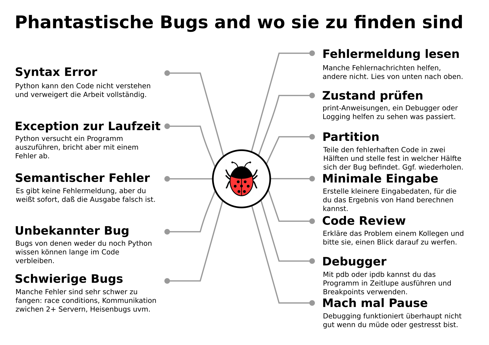

# Debugging

Debugging your code is a skill of its own.
In this chapter, you find a list of debugging tools and techniques that you might want to try.

## Challenge: Maze Generator

There should be more levels in the dungeon levels.
We could use a random algorithm to generate levels.
They might look like this:

    ##########
    #.#...#..#
    #........#
    #..##.##.#
    #.#..#...#
    #..#.....#
    ##.##.##.#
    #........#
    #...#....#
    ##########

In [generate_maze_buggy.py](generate_maze_buggy.py) you find a basic implementation of the algorithm.
However, it is **very buggy**. There are about 20 bugs in the program.

## Types of Bugs

In Python, you can distinguish multiple types of bugs:

## 1. SyntaxErrors

When there is a bug in the Python Syntax or indentation, Python will refuse to execute any code.
From the error message you know that there is a problem and roughly where it is.

Most of the time, syntax issues are fairly easy to fix. Your editor should highlight them right away.

## 2. Runtime Exceptions

When Python executes a part of the code but then crashes, you have an Exception at runtime.
The ``NameError``, ``TypeError``, ``ValueError`` and many others fall in this category.
The error message will give you some hints what to look for, but the source of the error might be somewhere else.
In any case you know there is a problem, and Python knows it too.

## 3. Semantic errors

If Python executes the code without error, but does not deliver the expected result,
you can call this a **Semantic Error**.
You still know that there is a problem, but Python doesn't.
Semantic errors are harder to debug.

## 4. Complex issues

More complex bugs are: race conditions (timing issues with multiple threads),
border cases (bugs that only occur with exotic input), and Heisenbugs (bugs that disappear when you start debugging them).
These are tough, and I won't cover them specifically here.

## 5. Unknown Bugs

Finally, there might be bugs in the program that nobody knows about.
This is of course bad, and we need to keep that possibility in the back of our heads.

## Debugging Techniques

* read the code
* read the error message (message on bottom, line numbers, type of error on top)
* inspect variables with `print(x)`
* inspect the type of variables with `print(type(x))`
* reproduce the bug
* use minimal input data
* use minimal number of iterations
* isolate the bug by commenting parts of the program
* drop assertions in your code
* write more tests
* explain the problem to someone else
* step through the code in an interactive debugger
* clean up your code
* run a code cleanup tool (``black``)
* run a type checker (``mypy``)
* run a linter (``pylint``)
* take a break
* sleep over it
* ask for a code review
* write down what the problem is
* draw a formal description of your program logic (flowchart, state diagram
* draw a formal description of your data structure (class diagram, ER-diagram)
* background reading on the library / algorithm you are implementing
* google the error message

### See also

- `Debugging Tutorial <https://www.github.com/krother/debugging_tutorial>`__
- `Kristians Debugging Tutorial Video <https://www.youtube.com/watch?v=04paHt9xG9U>`__
