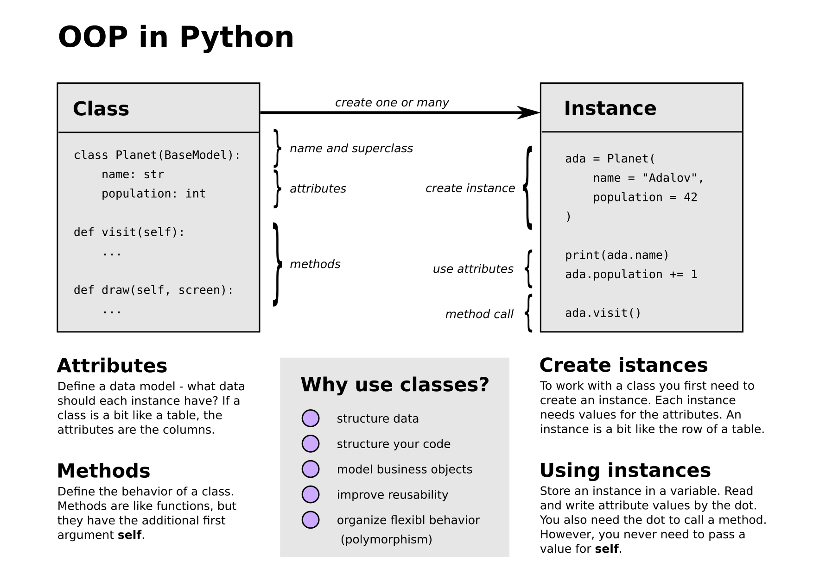

# OOP Principles

## SOLID Principles

The SOLID principles are a traditional description of good object-oriented practice. They are:

* **S - Single Responsibility Principle:** A class should have only one reason to change, meaning it should have only one responsibility.
* **O - Open/Closed Principle:** Software entities should be open for extension but closed for modification. It means you should not try to modify existing classes unless you are maintaining them.
* **L - Liskov Substitution Principle:** Objects of a superclass should be replaceable by objects of their subclasses without altering the correctness of the program.
* **I - Interface Segregation Principle:** Programming should be done against an interface, not the implementation underneath. That means, if you use a class, it should not be interesting how exactly it gets its job done.
* **D - Dependency Inversion Principle:** High-level modules should not depend on low-level modules; both should depend on abstractions.

These principles are 30 years old. Most of them, especially the last one, leave a lot of interpretation, especially in the Python world.

#### Example:

*In the Pac game, the game components (Pac, Level, Ghost) should not depend on how the graphics work. Likewise, the graphics engine should know nothing about the game mechanics. Having both is difficult to design but possible. E.g. you could have the PacGame class organize the communication between both through a few helper methods. In such a design, you could replace the pac game by a snake game, or the OpenCV graphics by a different graphics library without changing the respective other component.*

## Composition

Many of the SOLID principles manifest in the statement **"Prefer composition over inheritance"**.

## Python is special

Because object-orientation in Python is **one** option among others, everything you read about OOP has to be taken with a grain of salt. You might contrast the *"traditional"* OOP knowledge with the **Zen of Python** by Tim Peters:

    import this
