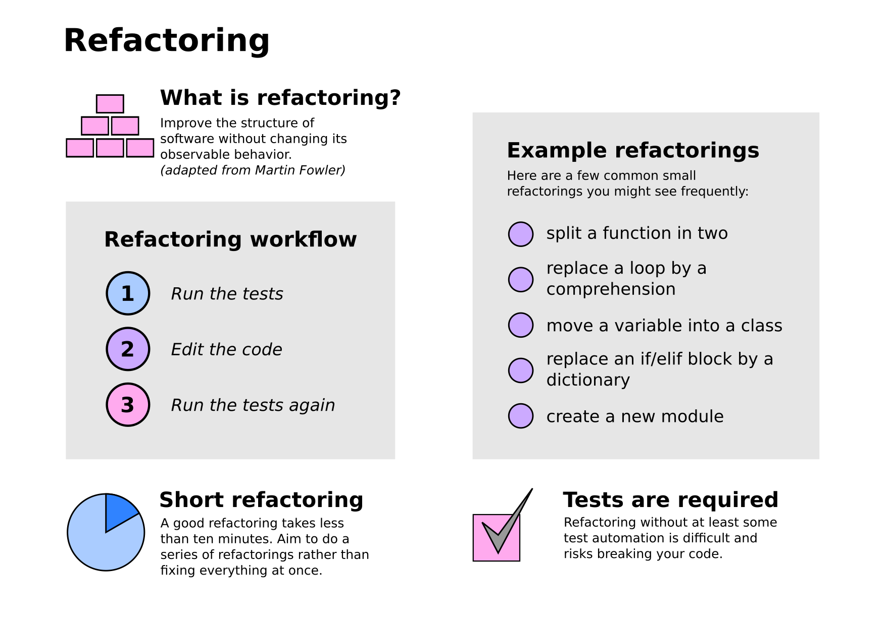

# Refactoring

**Refactoring improves the structure of your code without changing its observable behavior.** (Martin Fowler)

There are two fundamental types of refactoring:

### Small refactorings:

Atomic operations like moving a function, splitting a module, de-nesting code etc. These are greatly supported by automated tests and can be done in a short time (minutes or less).

**Never ask for permission to do these, this is part of the normal work of a programmer.**

### Large refactorings:

Involve changing the public interface of a part of code. Often they break the tests. May involve rewriting substantial parts of the code. These easily take hours, days or weeks.

**Should be communicated with your team in advance.**

## Exercise: Code Smells

Read the code of the pac game and note code smells (suspicious, dirty or hard-to-understand parts of the code). Use the following list of **typical code smells** for inspiration:

- the same name is used for different things
- code is hard to understand
- long sections of code (functions, classes, modules)
- classes with many attributes and methods
- a function does two different things
- repeating code sections
- in a function, mutable arguments are changed and there is a return value
- highly nested code